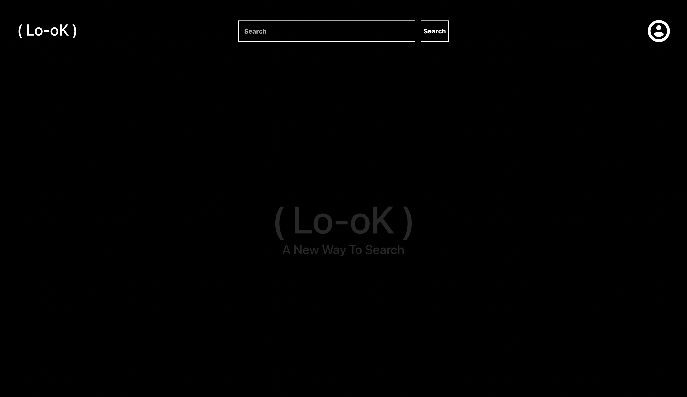
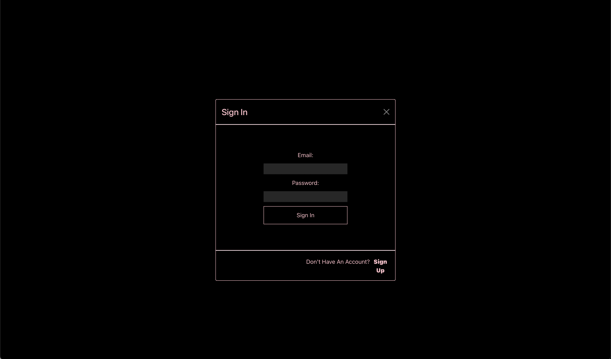
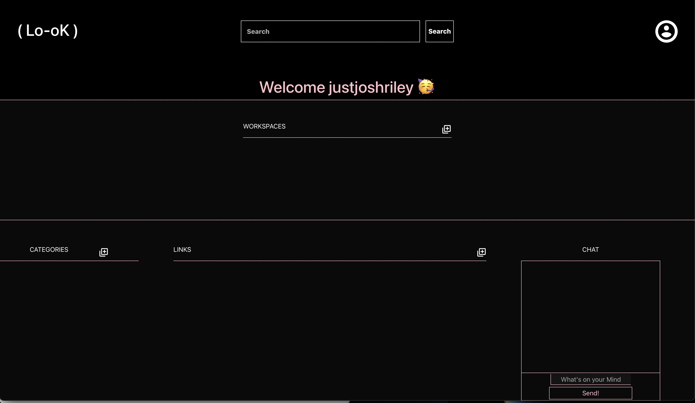

# ( Lo-oK )

Its time to change the way you organize your [LINKS](http://look-workspace.dev.justjoshriley.com/#/).

[Lo-oK](http://look-workspace.dev.justjoshriley.com/#/) is a search engine that is designed to help boost productivity acrossed teams by allowing users to create workspaces to organize links to websites that match their relevant category. 

[Lo-oK](http://look-workspace.dev.justjoshriley.com/#/) features a chat feature to allow users connected to the same workspace to communicate with other users.

### `Technologies Used`

* Python
* Javascript
* HTML
* CSS

### `Frameworks Used`

* React
* Flask

# How to Run the Project Locally

1. Git Clone
2. Run [npm run build && python3 -m flask run]
3. Go to [http://127.0.0.1:5000/](http://127.0.0.1:5000/)