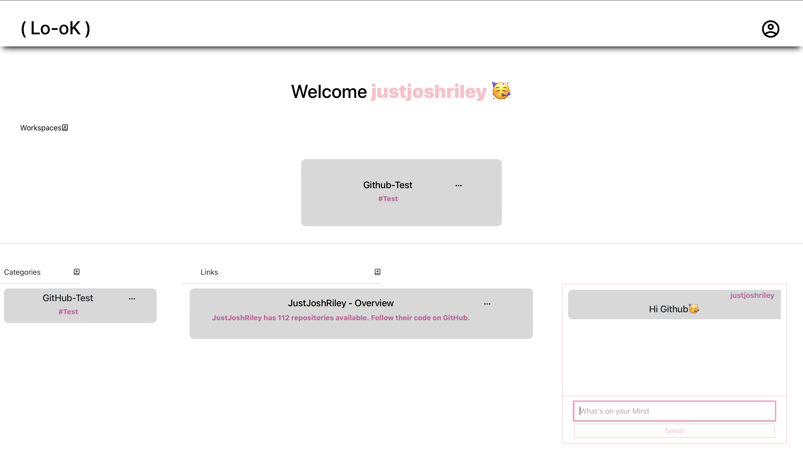
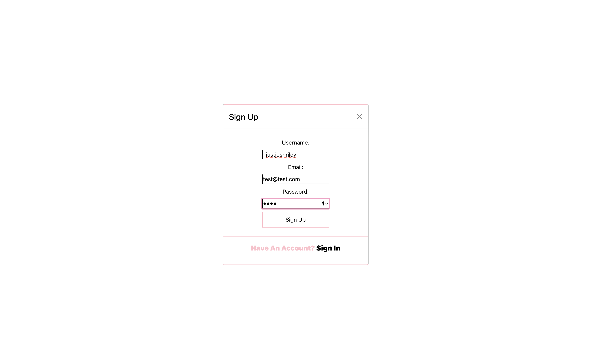
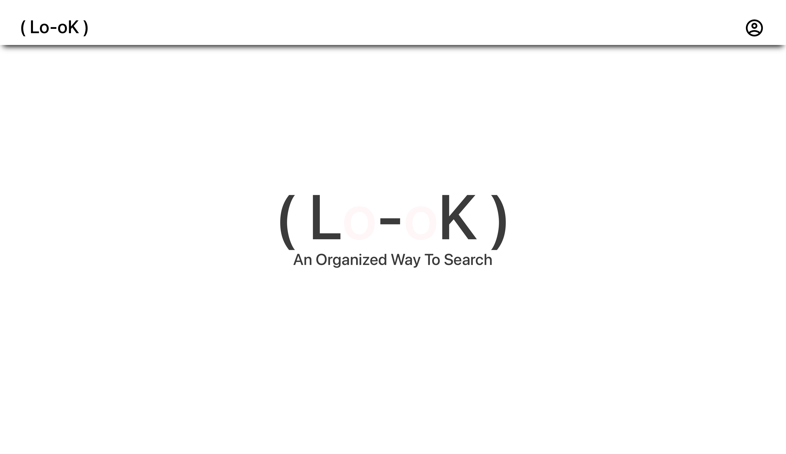

# ( Lo-oK )
Its time to change the way you organize your [LINKS](http://look-workspace.dev.justjoshriley.com/#/).
[DEMO HERE](https://drive.google.com/file/d/1Ljz6cZclCRw-4XozHdnxkU0LuefkTqz6/view).

# Why?
The goal of [Lo-oK](http://look-workspace.dev.justjoshriley.com/#/) was to showcase everything I had learned throughout my spring semester at Dominican University of California. With just tewo weeks to complete the project from start to finish, I present you the result of my hard work.

# What?
[Lo-oK](http://look-workspace.dev.justjoshriley.com/#/) was built in order for users to have an easier way to organize their bookmarked links. This project allows users to create folders that contain sub-folders that house important bookmarks(links).

Want to share your folders and links with other users?
Now you can, just add another user to your folder group (Workspaces) with the email they used to sign up and voila! The user you add will be able to see any updates and changes you make within the folder(Workspace).

Do your shared users have a question? 
No need to text, utilize the chat feature! The chat feature is tied to each workspace and authorized users can communicate back and forth in real-time!

# How?
This projects Front-End was bult with React with the Back-End built with Python.
Hosted on Caprover through a Digital Ocean Droplet

TL;DR?
### `How I Made Lo-oK`
* Python
* Javascript
* HTML
* CSS
* React
* Flask
* MongoDb

# How to Run the Project Locally

1. Git Clone
2. Run [npm run build && python3 -m flask run]
* Careful! You might need to run npm i to install the dependencies :)
3. Go to [http://127.0.0.1:5000/](http://127.0.0.1:5000/)